# 👁️ See You Later

> **읽을 시간이 없어도, 볼 시간이 없어도 — AI가 대신 읽고 봐드립니다.**

한국어 뉴스부터 영어 논문, 유튜브 강의, 2시간짜리 영화 리뷰 영상까지.  
언어와 형식을 가리지 않고 핵심만 뽑아 Slack과 Notion으로 바로 보내주는 크롬 확장 프로그램입니다.

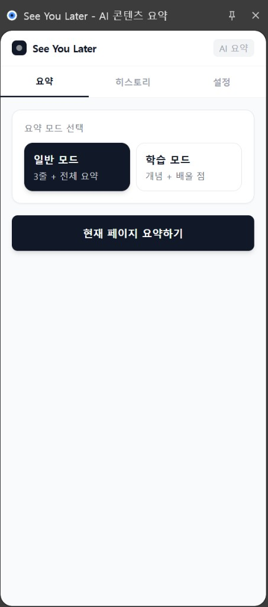

---

## ✨ 이런 콘텐츠를 요약할 수 있어요

| 콘텐츠 | 예시 |
|--------|------|
| 📰 뉴스 · 블로그 | 한국어 / 영어 / 일어 등 어떤 언어든 |
| 📄 해외 논문 · 리포트 | arXiv, PubMed, PDF 뷰어 페이지 |
| 🎬 유튜브 강의 · 다큐 | 자막 있는 영상은 전체 스크립트 분석 |
| 🎥 영화 · 드라마 리뷰 영상 | 1~2시간 분량도 처리 가능 |
| 📊 기술 문서 · 공식 문서 | GitHub README, MDN, Notion 페이지 등 |
| 🌐 SNS 스레드 · 롱폼 아티클 | Medium, Substack, 브런치 등 |

---

## 🚀 주요 기능

- **일반 모드** — 3줄 핵심 요약 + 전체 상세 요약
- **학습 모드** — 핵심 개념 · 배울 점 · 실제 적용 방법 구조화
- **추천도** — 냉정한 1~5점 평가 + 추천/스킵 대상 + 전문 읽기·시청 권장 여부
- **"나중에 볼 동영상" 자동 요약** — YouTube Watch Later 목록을 주기적으로 요약해 Slack/Notion으로 자동 전송. 사이드 패널이 닫혀 있어도 백그라운드에서 자동 동작
- **내보내기** — Notion 저장, Slack 전송, 마크다운 복사

### 주요 화면

**웹 페이지 요약**

| 일반 모드 — 3줄 + 추천도 | 학습 모드 — 핵심 개념 | 학습 모드 — 배울 점 + 내보내기 |
|:---:|:---:|:---:|
| 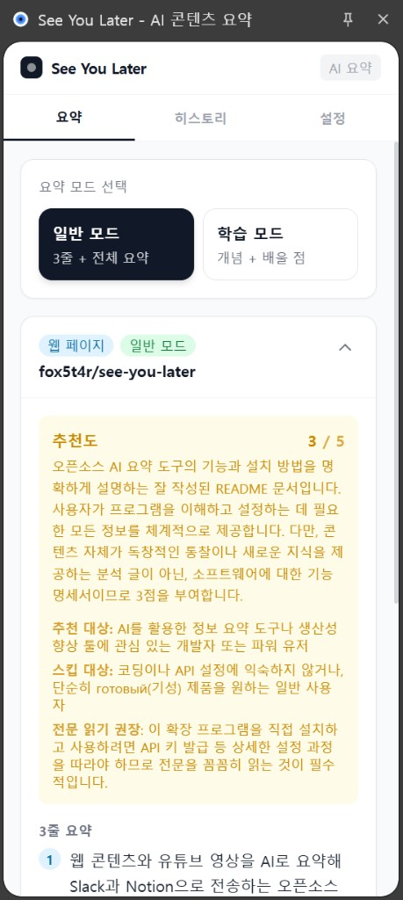 | 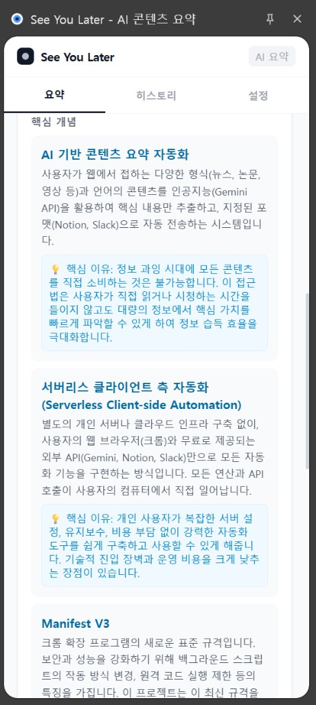 | 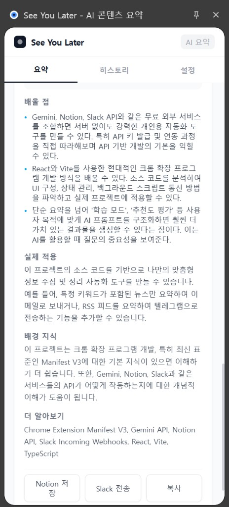 |

**YouTube 요약**

| YouTube 일반 모드 — 추천도 | YouTube 타임스탬프 + 내보내기 |
|:---:|:---:|
| 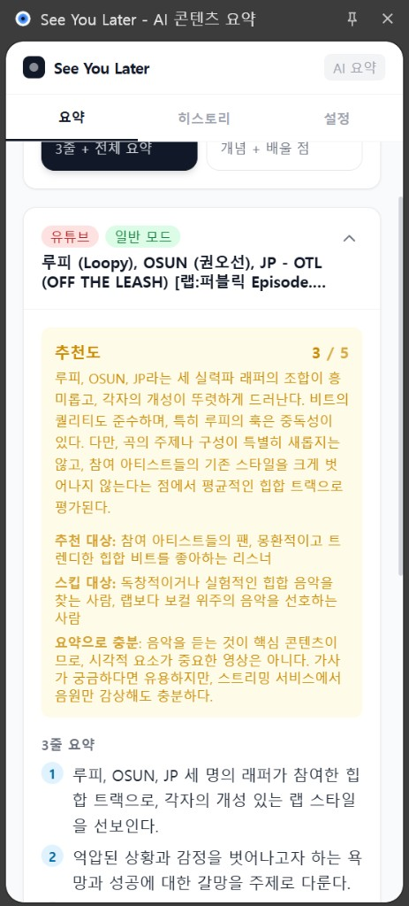 | 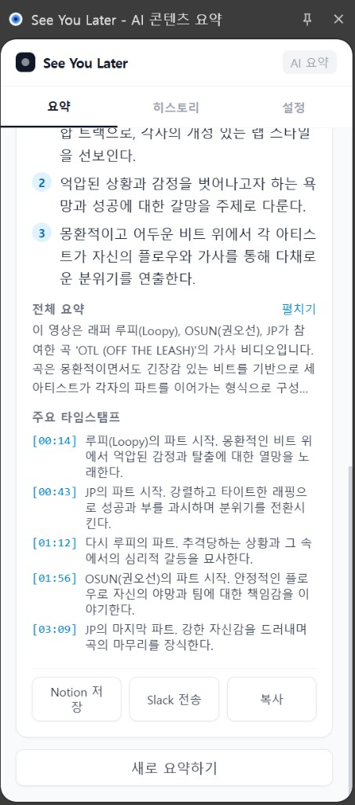 |

**설정 & 내보내기**

| 설정 화면 | Watch Later 자동 요약 설정 | Notion 저장 결과 | Slack 전송 결과 |
|:---:|:---:|:---:|:---:|
| 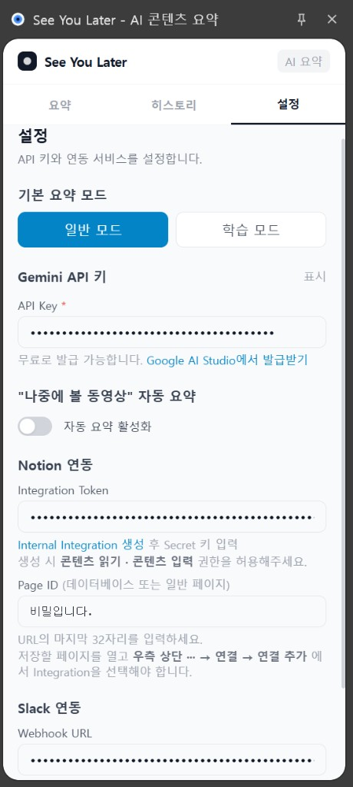 | 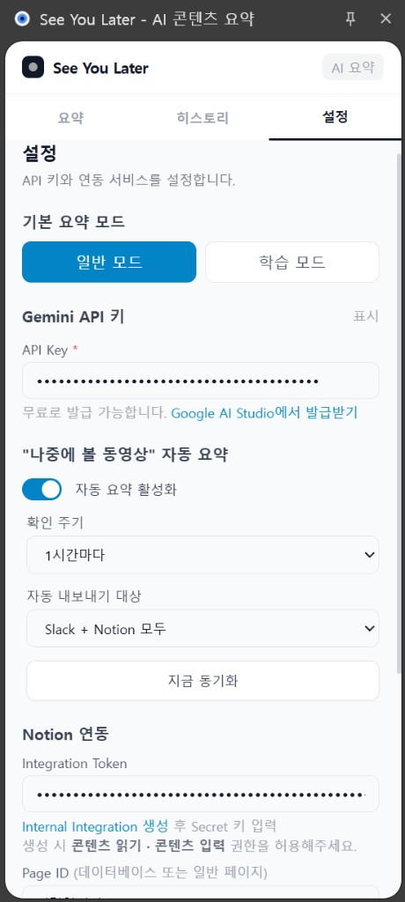 | 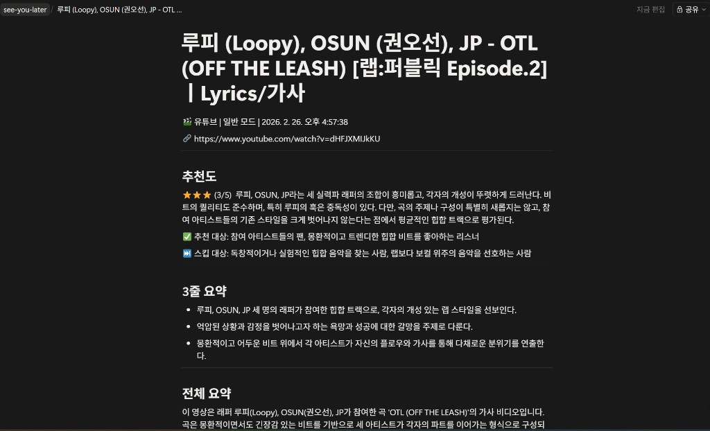 | 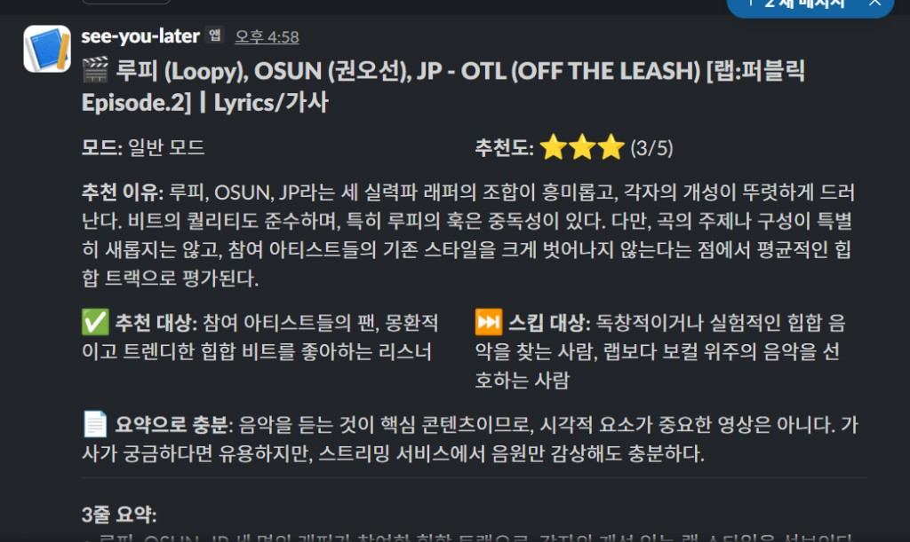 |

---

## 📦 설치 방법

### 방법 1: GitHub Releases (권장)

1. [Releases](../../releases) 페이지에서 최신 `see-you-later-vX.X.X.zip` 다운로드
2. 압축 해제
3. Chrome에서 `chrome://extensions` 접속
4. 우측 상단 **개발자 모드** 활성화
5. **압축 해제된 확장 프로그램을 로드합니다** 클릭
6. 압축 해제된 폴더 선택

### 방법 2: 소스에서 직접 빌드

```bash
git clone https://github.com/fox5t4r/see-you-later.git
cd see-you-later/extension
npm install
npm run build
```

빌드된 `extension/dist` 폴더를 위 3~6번 과정으로 로드합니다.

---

## ⚙️ 초기 설정 — API 키 발급 가이드

### 1단계: Gemini API 키 (필수)

요약 기능의 핵심입니다. **무료**로 발급받을 수 있습니다.

1. [Google AI Studio](https://aistudio.google.com/apikey) 접속
2. Google 계정으로 로그인
3. **"Create API key"** 버튼 클릭
4. 프로젝트 선택 또는 새 프로젝트 생성
5. 생성된 `AIza...` 형태의 키를 복사
6. 확장 프로그램 **설정 탭 → Gemini API 키** 입력란에 붙여넣기

> **무료 한도**: Gemini 3 Flash Preview 기준 하루 약 250회 요약 가능

---

### 2단계: Notion 연동 (선택)

요약 결과를 Notion 페이지에 자동 저장하려면 설정합니다.

#### 2-1. Integration Token 발급

1. [Notion Internal Integrations](https://www.notion.so/profile/integrations/internal) 접속
2. **"새 API 통합"** 버튼 클릭
3. 이름 입력 (예: `See You Later`)
4. **기능** 섹션에서 **콘텐츠 읽기**, **콘텐츠 입력** 권한 체크
5. **저장** 클릭
6. 생성된 `secret_...` 형태의 토큰을 복사
7. 확장 프로그램 **설정 탭 → Notion 연동 → Integration Token** 입력란에 붙여넣기

#### 2-2. Page ID 찾기

1. Notion에서 요약을 저장할 페이지 또는 데이터베이스 열기
2. 우측 상단 **···** 메뉴 → **연결** → **연결 추가** → 위에서 만든 Integration 선택
3. 브라우저 주소창의 URL 확인:
   ```
   https://www.notion.so/내-워크스페이스/페이지제목-xxxxxxxxxxxxxxxxxxxxxxxxxxxxxxxx
   ```
4. URL 끝의 **32자리 영문+숫자** 복사 (하이픈 포함해도 됨)
5. 확장 프로그램 **설정 탭 → Notion 연동 → Page ID** 입력란에 붙여넣기

> **주의**: Integration을 페이지에 연결하지 않으면 "접근 권한 없음" 오류가 발생합니다.

---

### 3단계: Slack 연동 (선택)

요약 결과를 Slack 채널로 자동 전송하려면 설정합니다.

1. [Slack API](https://api.slack.com/apps) 접속 → **"Create New App"** → **"From scratch"**
2. 앱 이름 입력 (예: `See You Later`) → 워크스페이스 선택 → **Create App**
3. 좌측 메뉴 **"Incoming Webhooks"** 클릭
4. **"Activate Incoming Webhooks"** 토글 ON
5. 하단 **"Add New Webhook to Workspace"** 클릭
6. 메시지를 받을 채널 선택 → **허용**
7. 생성된 `https://hooks.slack.com/services/...` URL 복사
8. 확장 프로그램 **설정 탭 → Slack 연동 → Webhook URL** 입력란에 붙여넣기

---

## 💰 비용 안내

모든 기능이 **무료 API 티어**로 동작합니다. 별도 서버 설치나 Docker 실행이 필요 없습니다.

| 기능 | 비용 |
|------|------|
| 웹 페이지 요약 | 무료 (Gemini 무료 티어) |
| 유튜브 요약 (자막 있음) | 무료 (Gemini 무료 티어) |
| 유튜브 요약 (자막 없음) | 무료 (Gemini 무료 티어) |
| Notion 저장 | 무료 |
| Slack 전송 | 무료 |

**무료 한도**: 하루 약 250회 요약 가능 (Gemini 3 Flash Preview 기준)  
초과 시 유료 API 키로 업그레이드하면 됩니다.

---

## ⭐ 추천도 평가 기준

모든 콘텐츠에 냉정하고 까다로운 기준으로 점수를 매깁니다. 대부분의 콘텐츠는 2~3점입니다.

| 점수 | 의미 | 비율 |
|------|------|------|
| ⭐⭐⭐⭐⭐ | 해당 분야 필독/필시청. 독창적 통찰과 탁월한 가치 | 상위 5% |
| ⭐⭐⭐⭐ | 꽤 좋음. 새로운 관점이나 깊이 있는 분석 | 상위 20% |
| ⭐⭐⭐ | 평균. 읽으면 얻는 것이 있지만 특별하지 않음 | 대부분 |
| ⭐⭐ | 평균 이하. 이미 알려진 정보 반복, 깊이 부족 | — |
| ⭐ | 스킵 권장. 낚시성 제목, 내용 빈약, 광고성 | — |

추천도와 함께 다음 정보도 제공됩니다:
- **추천 대상** — 이 콘텐츠가 누구에게 유용한지
- **스킵 대상** — 어떤 사람은 굳이 보지 않아도 되는지
- **전문 읽기 / 직접 시청 권장** — 요약으로 충분한지, 원본을 봐야 하는지

---

## 📌 참고사항

### "나중에 볼 동영상" 자동 요약

- **백그라운드 동작**: 확장 프로그램 사이드 패널이 닫혀 있어도 설정한 주기마다 자동으로 새 영상을 감지하고 요약합니다. Chrome이 실행되어 있기만 하면 됩니다.
- **이미 처리한 영상은 재확인하지 않습니다**: 한 번 요약이 완료된 영상 ID는 기록되어, 다음 주기에는 새로 추가된 영상만 처리합니다.
- **영상이 많거나 길 경우 지연될 수 있습니다**: 각 영상 요약에 약 10초가 소요되며, API 한도 보호를 위해 6.5초 간격을 두고 순차 처리합니다. 10개의 영상이면 약 2~3분이 걸릴 수 있습니다.
- **수동 동기화**: 설정 탭에서 "지금 동기화"를 누르면 Slack/Notion 자격증명이 있는 모든 서비스로 즉시 내보내기됩니다 (자동 내보내기 대상 설정과 무관).

---

## 🛠️ 기술 스택

| 영역 | 기술 |
|------|------|
| 크롬 확장 | Manifest V3, TypeScript, React 18, Tailwind CSS, Vite |
| AI 요약 | Gemini 3 Flash Preview (Google) |
| 내보내기 | Notion API, Slack Webhook |

---

## 🏗️ 시스템 아키텍처

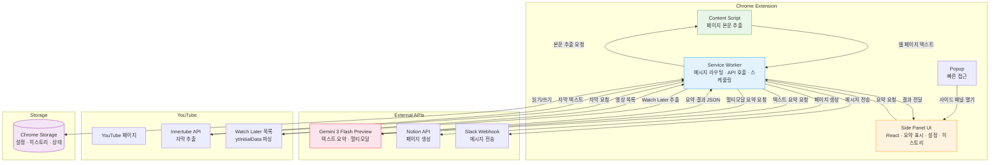

### 데이터 흐름

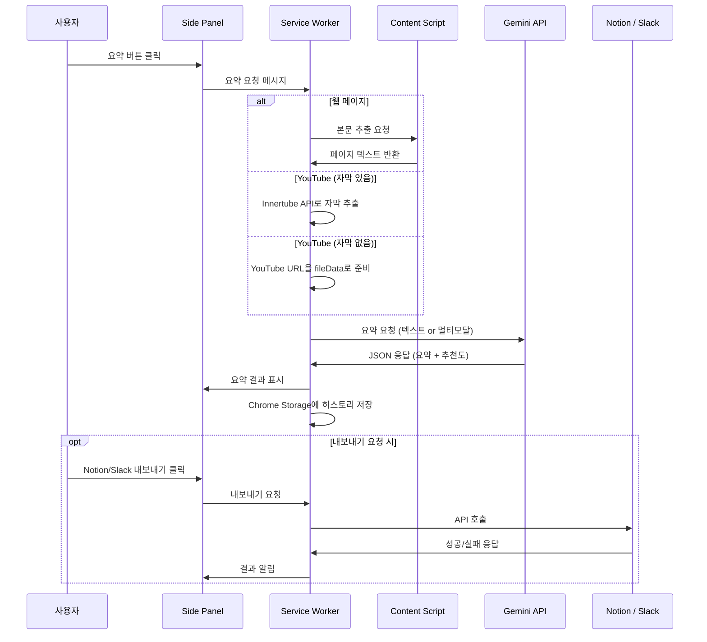

### Watch Later 자동 요약 흐름

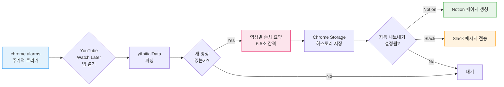

---

## 📂 프로젝트 구조

```
see-you-later/
├── extension/                    # 크롬 확장 프로그램
│   ├── src/
│   │   ├── background/          # Service Worker
│   │   ├── content/             # Content Script (페이지 본문 추출)
│   │   ├── sidepanel/           # Side Panel UI (React)
│   │   │   └── components/      # SummaryCard, SettingsView, HistoryList
│   │   ├── popup/               # Popup UI
│   │   ├── lib/                 # 핵심 라이브러리
│   │   │   ├── gemini.ts        # Gemini API 클라이언트
│   │   │   ├── youtube.ts       # YouTube 자막 추출
│   │   │   ├── watch-later.ts   # Watch Later 자동 요약
│   │   │   ├── notion.ts        # Notion 내보내기
│   │   │   ├── slack.ts         # Slack 내보내기
│   │   │   ├── storage.ts       # Chrome Storage 관리
│   │   │   └── markdown.ts      # 마크다운 변환
│   │   ├── prompts/             # AI 프롬프트 템플릿
│   │   └── types/               # TypeScript 타입 정의
│   ├── manifest.json            # Manifest V3
│   └── vite.config.ts           # Vite 빌드 설정
├── .github/
│   ├── workflows/               # CI/CD (GitHub Actions)
│   ├── ISSUE_TEMPLATE/          # 이슈 템플릿
│   └── PULL_REQUEST_TEMPLATE.md # PR 템플릿
├── .husky/                      # Git hooks (commitlint)
├── docs/
│   ├── ai-usage.md              # AI 도구 활용 기록
│   └── planning.md              # 기획 과정 문서
├── README.md
├── CONTRIBUTING.md              # 기여 가이드
└── DEVLOG.md                    # 개발 로그
```

---

## 📄 라이선스

MIT
